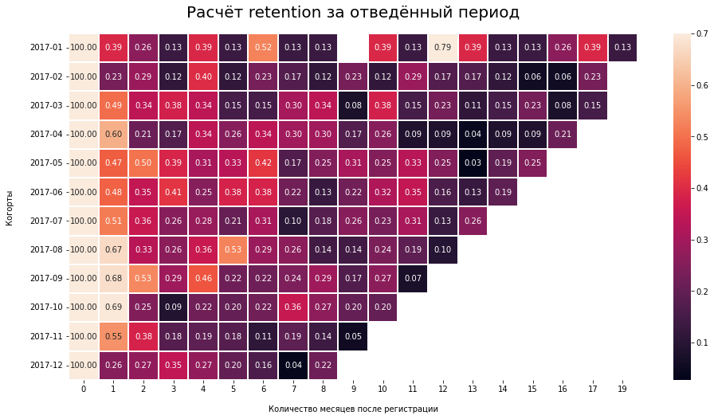

<h2>Задача</h2>

1. Скачать несколько файлов с информацией клиентов и их заказов с Яндекс.Диска.
2. На основе информации о клиентах сделать когортный анализ и посчитать retention.
3. В период с января по декабрь выяви когорту с самым высоким retention на 3й месяц.

<h2>Что сделал</h2>

1. Прочитал файл с Яндекс.Диска с помощью API и сохранил в переменные.
2. Приготовил данные для работы: отобрал только нужные столбцы, перевёл в нужные типы данных, добавил недостающие столбцы.
3. Сформировал когорты по пользователям, оставил только когорты за указанный период.
4. Сделал сводную таблицу, посчитал retention и нужный ответ записал в переменную cohort_3_month_with_max_retention
5. Визуализировал таблицу с помощью seaborn.heatmap

<h2>Выводы</h2>

Более 99% пользователей не делают заказ во второй месяц и в целом мало пользователей делают более 1 заказа. Нам стоит сосредоточиться на увеличении retention!
